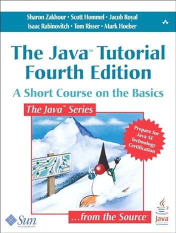

# Course Introduction

------

## Welcome

Welcome to the course of *Multiobjective Optimization*

Course:

- XXXXX - `TCC00341` (turma A1) - C.H. 64
- Site: https://igormcoelho.github.io/course-multiobjective-optimization

Useful links:

- http://www.ic.uff.br/index.php/pt/curriculo-e-disciplinas/disciplinas-obrigatorias
- https://app.uff.br/graduacao/quadrodehorarios
- https://app.uff.br/iduff
- Instituto de Computação (IC/UFF) - www.ic.uff.br
- Universidade Federal Fluminense (UFF) - www.uff.br

--------

## About me

::::::::::::: {.columns}

::::: {.column width=40%}

{width=50%}

e-mail (with subject '[MO-2024.2]'):

imcoelho at ic.uff.br (emergency only!)

:::::

::::: {.column width=60%}

I'm named Igor, and it's a pleasure to present this course to you all! I'm professor and researcher at UFF, also developer of algorithms and systems (mostly open-source), being integrated and in love with the field of optimization. 
You can contact me by the emails in the side (*please replace 'at' with '@'*), but I ask you to priotize the usage of the academic tools for communication such as the course digital Classroom, that I can manage to answer faster (also can be the same question of the other colleagues).
This course is available at my personal website and github: https://igormcoelho.github.io/course-multiobjective-optimization

:::::

:::::::::::::

--------

## About you

I would like you all to present yourselves, so that we know each other better!

This course is written in English, to allow international students to join us, but discussions will be mostly in Portuguese (with some questions and explanations also possibly in English).

Nobody learns  100% of that the professor teachers, and also the professor is not able to know 100% of anything, so it's **up to you** to: *read*, *study* e *question* (a lot!). **Together** we can work to share and build this precious knowledge.

Every time you have a question or some curiosity, ask it! Every question is valuable, and the knowledge is build step by step.

-------

## Teacher-Student Agreement

*For this course to work you must have some passion and dedication!*

It is fundamental to:

- Do not delay the delivery of works, and if you need some deadline extension, ask it before the deadline! (*delays can reduce or even make the grade be zero*)
- Try not to miss classes, and if you do, try to learn what was explained as soon as possible
- Never, ever, copy the work from the others! The practical effects can be losing the activity grade or any other sanctions allowed by the university, but the worst is: the one who loses the most is the student. Knowledge is the most valuable asset!
- **Always** quote the sources, specially for texts. Whenever possible, indicate the license for the reuse of images and source code (the search engines allow filtering for free licenses, such as CC-BY 4.0).

--------

## Period 2024.2 - presential classes

Activities for 2024.2

- Graduate Period: 26/08/2024 - 13/12/2024
- Undergraduate Period: 23/09/2024 - 06/02/2025

- Final Grades: 13/12/2024 (last class)

We will have presential classes in regular scheduled times and other assinchronous complementary activities (videos, texts, works, ...) to complete all the course hours.

---------

## Schedule

Times: fridays 18h-22h

(*) Some exceptions can happens and some times can be changed, if necessary, but this is the general rule.

--------

## Evaluation

There  will be two major activities with delivery of written report/article (T1) and (T2), one for single-objective and other for multi-objective, where the second also requires a presentation. The will also be minor deliveries (R), such as exercises and practices.

The grade will be given as:

N1 = 20%R + 35%T1 + 45%T2

According to the rules of UFF, the minimum grade N1 for approval is 6.

There can be a supplementary exam for those with grade above 4,0.

--------

## Schedule (I)

- Period: 26/08/2024 - 13/12/2024

Tipo = Sinc./Asinc.

| Date       |  Activity                                 | Type    |
| :---       |   :----                                   | :---    |
| 30/08/2024 |  Platform subscription to Classroom       |  Async. | 
| 06/09/2024 |  Introduction to Course                   |  Sync.  | 
| 24/10/2024 |  Delivery V (estimated)                   |  Async.  |

TODO...

-------

## Schedule (IV)

| Date       |  Activity                       | Type     |
| :---       |   :----                         | :---     |
| 01/11/2024 |  Presentation P                 |  Sync    |
| 08/11/2024 |  Presentation P                 |  Sync    |
| 15/11/2024 |  FERIADO                        |  NONE    |
| 29/11/2024 |  VR                             |  Sync.   |
| 06/12/2024 |  VS                             |  Sync.   |
| 13/12/2024 |  Final Grades                   |  *Asinc. |
| 13/12/2024 |  End                            |  *Async. |

-------

## Content

Introdução e motivação à Otimização com Inteligência Computacional. Problemas de otimização.
Problemas de otimização combinatória. Problema do caixeiro viajante. Problema da mochila. Problemas
de otimização em grafos. Busca inteligente e heurísticas. Heurísticas construtivas. Heurísticas de
refinamento e de busca local. Metaheurísticas. Simulated Annealing. Algoritmos Genéticos. Busca Tabu.
Busca em Vizinhança Variável. Frameworks para o desenvolvimento de algoritmos de otimização.
Introdução a Programação genética e hiper-heurísticas. Frentes e Conjuntos de Pareto. 
Estrutura de Meta-heurísticas multiobjetivas: Fitness Assignment e Diversity Management.
Meta-heurísticas multiobjetivas NSGA-II, SPEA, IBEA. Indicadores de cobertura e hipervolume.

-------

## Recommended Bibliography

::::::::::::: {.columns}

::::: {.column width=40%}

{width=50%}*

:::::

::::: {.column width=60%}

(*) El-Ghazali Talbi. Metaheuristics from Design to Implementation, Wiley, 2009

:::::

::::::::::::: 

- Marcone Jamilson Freitas Souza. Notas de Aula "Inteligência Computacional para Otimização", [PDF Online em www.decom.ufop.br](http://www.decom.ufop.br/prof/marcone/Disciplinas/InteligenciaComputacional/InteligenciaComputacional.pdf), 2024.
- El-Ghazali Talbi. Metaheuristics from Design to Implementation, Wiley, 2009.
- Marcos Arenales et al, Pesquisa operacional: para cursos de engenharia, Editora Campus, 2007
- Michel Gendreau, Jean-Yves Potvin, Handbook of Metaheuristics, Springer, 2010
- Ricardo Linden, Algoritmos Genéticos, Editora Brasport Livros e Mutimídia Ltda, 2006.

# Agradecimentos

-----

## Pessoas

Em especial, agradeço aos colegas que elaboraram bons materiais, como os profs. Raphael Machado, Kowada e Viterbo cujos conceitos formam o cerne desses slides.

Estendo os agradecimentos aos demais colegas que colaboraram com a elaboração do material do curso de [Pesquisa Operacional](https://github.com/igormcoelho/curso-pesquisa-operacional-i), que abriu caminho para verificação prática dessa tecnologia de slides.

-----

## Software

Esse material de curso só é possível graças aos inúmeros projetos de código-aberto que são necessários a ele, incluindo:

- pandoc
- LaTeX
- GNU/Linux
- git
- markdown-preview-enhanced (github)
- visual studio code
- atom
- revealjs
- ...

-----

## Empresas

Agradecimento especial a empresas que suportam projetos livres envolvidos nesse curso:

- github
- gitlab
- microsoft
- google
- ...

-----

## Reprodução do material

Esses slides foram escritos utilizando pandoc, segundo o tutorial ilectures:

- https://igormcoelho.github.io/ilectures-pandoc/

Exceto expressamente mencionado (como materiais cedidos por outros professores), a licença será Creative Commons.

**Licença:** CC-BY 4.0 2020

Igor Machado Coelho