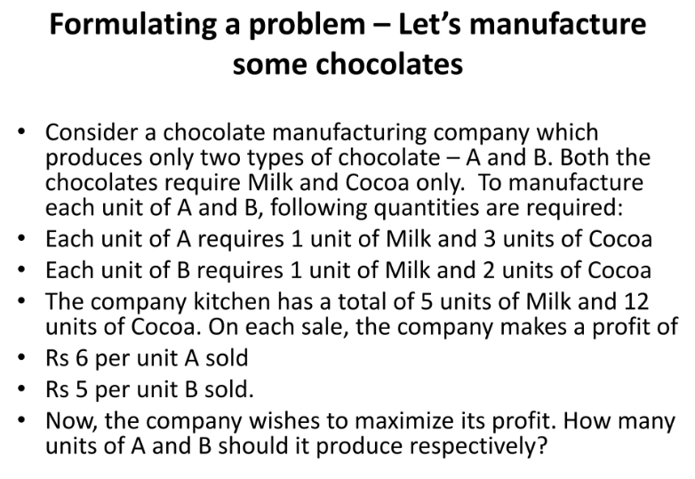
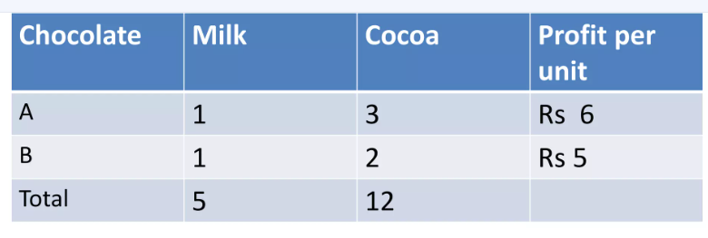
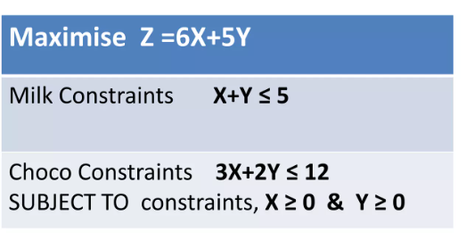
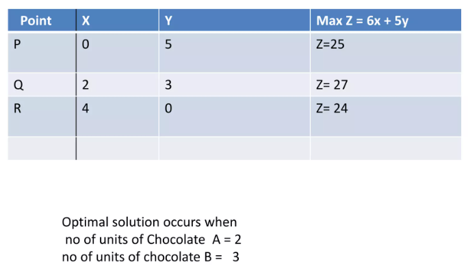
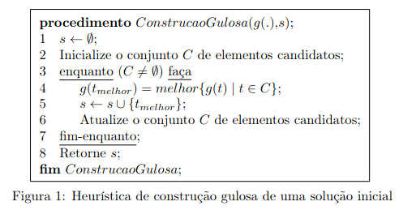

# Module: Fundamentals

------

## Requirements

The requirements for this class are:

- Data Structures and Algorithmic Complexity
   * Graph concepts
- Programming in Python or C/C++

------

## Topics

- ...


# Fundamentals

------

## Brief History: Optimization with Linear Programming

- The combinatorial optimization field is growing in Brazil and the World, began in second world war
   * Groundbreaking work on Linear Programming and Simplex (George Dantzig)
   * Leonid Kantorovich and  Wassily Leontief in 1930s
   * Dantzig with formal proof "A Theorem on Linear Inequalities" on January 5, 1948
   * https://en.wikipedia.org/wiki/Linear_programming
- Dantzig's original example was to find the best assignment of 70 people to 70 jobs
   * Rápido no Simplex. Tentativa e erro: milhares de anos
- Linear Programming solvable in polynomial time by Leonid Khachiyan in 1979
- Narendra Karmarkar presents Interior-Point Method in 1984

------

## Problem Solved by Linear Programming



-------

## Data for the Chocolate Problem



------

## Modeling in Linear Programming (Example)



------

## Solving the Chocolate Problem



------

## Not all problems are that easy

- Unfortunately (or fortunately), Linear Programming does not solve all problems
- Some usual problems not solved by LP
   * A limited knapsack must be filled with valuable items, each having a weight and value. How to maximize the value of the selected items within the capacity of the knapsack?
   * A tourist wants to visit all famous points in Rio de Janeiro, without repetition and come back to the initial point. How to do it in the shortest possible time?
- These seem to be easy, but are in fact *intractable problems*
   * There's *currently* no *polynomial time* algorithms to solve them exactly!


# Basic Definitions

## Definitions 

- Many practical problems are modeled in the following way:
   * given a set $XS$ of discrete variables $s$, called *solutions*
   * given a set $XE$ of values $e$, called *evaluations* (e.g., $\mathbb{R}$ or $\mathbb{Z}$)
   * given a single objective (SO) function $f: XS \rightarrow XE$, that maps each solution $s \in XS$ to a value $f(s)$
   * find the a solution $s^* \in XS$, called *optimal*, such that no other soution $s' \in XS$ is *better* than $s^*$
- For now, it can be a *maximization* or *minimization* problem, as long as $XE$ is a *total order*
   * For *minimization*, we have that $f(s^*) \leq f(s'), \forall s' \in XS$
   * For *maximization*, we have that $f(s^*) \geq f(s'), \forall s' \in XS$

## Definitions Part II

- Many of these problems are of combinatorial nature
- Those not solved in *polynomial time* are called *intractable*
- Many problems are classified in literature as $\mathcal{NP}$-Hard
   * there's no known polynomial time algorithm to solve them!
- Remember Computational Complexity classes... 
   * Problems are are *easy to solve*, belong to $\mathcal{P}$
   * Problems with solutions that are are *easy to check* (also called a *certificate*), belong to $\mathcal{NP}$
   * If Problem belongs to $\mathcal{NP}$ and $\mathcal{NP}$-Hard, then it's $\mathcal{NP}$-Complete
- Example: the well known Traveling Salesman Problem (TSP)
- The TSP is described as a set of $n$ cities and a distance matrix between them
   * salesman must leave some given city and visit all other $n - 1$ only once and return to the first city
   * Objective: minimize total distance
- In other words, *find a hamiltonian cycle* that returns to the first city, with minimum length

## Example of TSP


# Neighborhood Exploration

### Quick discussion for the TSP...

How is XS represented? How is XE represented? Are all representations valid? Is $XInfeasible = \emptyset$? What about missing arcs in graph?

## Difficulty of the Brute Force

- To demonstrate the difficulty of solving the TSP by brute force
   * assume there are $n$ cities
   * assume that the distance $d$ from city $i$ to other $j$ is simmetric, i.e., $d_{ij} = d_{ji}$
   * so, the total number of routes in XS space is $(n - 1)!/2$
- The magnitude of such a number is that the enumeration of all solutions in XS space:
   * for n = 20, we have $6 \times 10^{16}$ routes
   * A computer that evaluates a route in $10^{-8}$ seconds would take around 19 years to find the best route!
- Even with the fast technological advances of the computers, a full enumeration is unconceivable for higher values of $n$
- For problems belonging to $\mathcal{NP}$-hard class, it's not possible to guarantee that the optimal route is found in polynomial time
   * In worst case, all possible solutions must be analysed

## The Practical Solution: Heuristics

- Although it's possible to use Linear Integer Programming (LIP) to model the TSP, the Simplex alone cannot solve a LIP
   * *Branch & Bound* techniques can solve it, but with exponential time enumeration in worst case!
- The pratical solution if optimal is not strictly required: use *heuristics*
- Fortunately, if we want a "good" solutions in "short" computational time, we may be able to do that!
   * What is "good"? What is "short"? It depends...
- Heuristics are part of a very fruitful research field that mixes knowledge from *Artificial Intelligence* (AI) field
   * The general field for such techniques is called *Computational Intelligence* (CI)
- The major benefit of heuristics is their flexibility
   * Even if problem changes "a little bit", one can still hope to solve it "reasonably well on practice"
- We begin talking about the most basic heuristics: *Constructive Heuristics*

## Constructive Heuristics

- A constructive heuristic begin with an *empty solution* and keep adding "components" to it, until it's *complete* (typically *greedy* or *randomized*)
   * It is *highly problem-specific*! Every problem can have many different...
   * It may return an *incomplete solution*, acording to some timelimit stop criteria or due to problem impossibility



## Example: Knapsack Problem

Definition of Knapsack Problem and others... (see Marcone slides)

# Practical Exercise

## Implementing a Constructive Heuristic (Step 1/3)

- Choose a language: Python or C/C++
- Consider the following data for a Knapsack Problem with $n=5$ items and capacity $Q=10$

```
5
10
1 1 1 5 5
1 2 3 7 8
```

- Save it into a file and read it
   * First load the $n$ and $Q$
   * Then, for each item, load each profit $p_i$ and weight $w_i$

## Implementing a Constructive Heuristic (Step 2/3)
- Model the solution representation as an array (or list) of booleans or binary numbers
- Create a constructive heuristic function to build a **random** initial solution, given timelimit of $t$ seconds (otherwise, just return an empty solution)
- Create a constructive heuristic function which is *smarter* to build an initial solution. Also respect a given timelimit of $t$ seconds (otherwise, just return an empty solution)
- You can choose to allow or not the construction of *infeasible* solutions, regarding knapsack capacity

## Implementing a Constructive Heuristic (Step 3/3)
- Model the objective space XE as with an evaluation function that receives a *complete* solution as parameter and returns a *number* or an *Evaluation* object carrying a number
- If you allow *infeasible* evaluations, a common strategy is to put a "big" negative weight that will "punish" for every unit of weight that surpasses capacity
   * How big should this weight be? 100? 1000000? What if you consider the negative sum of all profits as penalization for every unit of weight? Will this allow an optimal solution to be infeasible? Make sure the problem heuristic model is not *impossible*.
- Generate 10 different initial solutions and compare them. Which of the two constructive methods is better on *average*?


# Discussions

## Short discussion

### Current scenario: optimization problems in the university and work

- Do you know of any optimization problem that needs to be solved in the university or your work?
- Can exact methods solve them? Do you need heuristic methods?
- Read the introduction material from prof Marcone (in Portuguese): http://www.decom.ufop.br/prof/marcone/Disciplinas/InteligenciaComputacional/InteligenciaComputacional.pdf

# Agradecimentos

-----

## Pessoas

Em especial, agradeço aos colegas que elaboraram bons materiais, como o prof. Raphael Machado, Kowada e Viterbo cujos conceitos formam o cerne desses slides.

Estendo os agradecimentos aos demais colegas que colaboraram com a elaboração do material do curso de [Pesquisa Operacional](https://github.com/igormcoelho/curso-pesquisa-operacional-i), que abriu caminho para verificação prática dessa tecnologia de slides.

-----

## Software

Esse material de curso só é possível graças aos inúmeros projetos de código-aberto que são necessários a ele, incluindo:

- pandoc
- LaTeX
- GNU/Linux
- git
- markdown-preview-enhanced (github)
- visual studio code
- atom
- revealjs
- groomit-mpx (screen drawing tool)
- xournal (screen drawing tool)
- ...

-----

## Empresas

Agradecimento especial a empresas que suportam projetos livres envolvidos nesse curso:

- github
- gitlab
- microsoft
- google
- ...

-----

## Reprodução do material

Esses slides foram escritos utilizando pandoc, segundo o tutorial ilectures:

- https://igormcoelho.github.io/ilectures-pandoc/

Exceto expressamente mencionado (com as devidas ressalvas ao material cedido por colegas), a licença será Creative Commons.

**Licença:** CC-BY 4.0 2020

Igor Machado Coelho

-------

## This Slide Is Intentionally Blank (for goomit-mpx)
