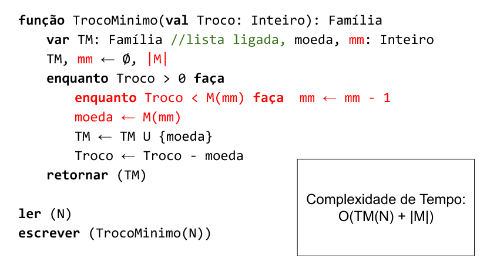

# Module: Greedy Heuristics

------

## Requirements

The requirements for this class are:

- Data Structures and Algorithmic Complexity
   * Graph concepts
- Programming in Python or C/C++
- Module 1 - Fundamentals

------

## Topics

- ...


# Greedy Heuristics

------

## Some Definitions

Recall basic definitions for an optimization problem, such as solutions and evaluations, and classic NP-hard problems such as the Knapsack Problem and Traveling Salesman Problem.
More precisely:

- The $XS$ denotes a *Solution Space*, where $XE$ is an *Evaluation Space* (or *Objective Space*)
   * The pair $XES=\;<XS,XE>$ denotes the $XESolution$ space
   * A *SO optimization problem* is defined by the triple $<XS, XE, f>$
- The space $XE$ can be partioned into $XE=XFeasible \cup XInfeasible$, where $XFeasible \cap XInfeasible = \emptyset$
- $XS$ denotes all *valid representations of a solution*, that are *structurally correct*
   * it may include *infeasible* solutions $s$, that are *valid*, but with *infeasible* evaluation $f(s) \in XInfeasible$
   * it depends on how the problem is modeled, but it's not uncommon to have $XInfeasible \neq \emptyset$
- The optimal solution $s^*$ is always feasible $f(s^*) \in XFeasible$, unless the problem is *impossible*


## Basic Structure of Greedy Constructive Heuristics

- Recall that a heuristic is an algorithm inspired by human thought processes
- The optimal solution is not the main target: but it *may* lead to some *good quality* solution
- To build a solution, we need some Constructive Heuristic
- Typically Greedy or Randomized
   * Or maybe *both*? More on this latter...

## Constructive Heuristics (Again)

- A constructive heuristic begin with an *empty solution* and keep adding "components" to it, until it's *complete* (typically *greedy* or *randomized*)
   * It is *highly problem-specific*! Every problem can have many different...
   * It may return an *incomplete solution*, acording to some timelimit stop criteria or due to problem impossibility


# Exact Greedy Algorithms

## Greedy Algorithms (part 1/3)

- Greedy is a Technique for the construction of algorithms with the following characteristics
   * usually, solves an optimization problem
   * the solution of the problem can be described recursively (optimal substructure)
   * differently from Dynamic Programming, not all forms of generating subproblems are considered (only those which are the *best* in the moment - "greedy choice")
   * the greedy step only depends on choices made in previous step (not in future ones)

## Greedy Algorithms (part 2/3)

- In general:
  * it's a natural and intuitive manner of solving problems
  * it leads to efficient algorithms
  * not always leads to optimal results (so it's important to analyze/prove its correctness)

## Greedy Algorithms (part 3/3)

- The solution of a problem by the Greedy technique usually involves 5 steps (see "recipe" from prof Fabiano Oliveira):
   1. Characterize the optimal substructure of the problem
   2. Define the value of an optimal solution for each problem recursively
   3. Characterize the greedy choice (for each subproblem, show that an optimal solution of one of the sub-subproblems belong to the optimal solution of the subproblem)
   4. Compute an optimal solution of each subproblem in "top-down" manner
   5. Transform the recursive algorithm in iterative

## Minimum Change Problem (*Troco Mínimo*)

   - Minimum Change Problem (MCP): given a set of Coin Values M, determine the minimum number of coins to give a Change of value N. Examples:
      (a) $M = \{1,5,10,25,50,100\}\; N=27$
      (b) $M = \{1,5,12,24,50,100\}\; N=20$

## MCP Modeling - Step 1/5

- Step 1: Characterize the optimal subestructure of the problem

Consider MCP(N) to be the minimum change for N

Example: MCP(37) = 4, for $M = \{1,5,10,25,50,100\}$

Suppose $N>0$. Suppose that $m \in M$ belongs to a minimum change T of M. What can you say about $|T - \{m\}|$

## MCP Modeling - Step 1/5 (proof)

- Step 1: Characterize the optimal subestructure of the problem

We affirm that $|T - \{m\}| = MCP(N - m)$, because otherwise:

- If $|T-\{m\}| > MCP(N-m)$, then we would be able to replace all coins of T, except by m, by a smaller change of $N - m$. Thus, we obtain a change for N with less coins than T, contradicting the fact that T is a minimum change

- If $|T - \{m\}| < MCP(N - m)$, then all the coins of T, except by m, form a change of $N -m$ with less coins than the Minimum change of $N- m$, thus a contradiction

## MCP Modeling - Step 2/5

- Step 2: Define the value of an optimal solution of each subproblem recursively

Let $m \in M$

If we knew that $m$ belongs to a minimum change of $N$, then $MCP(N) = 1 + MCP(N-m)$. But we don't know that! What to do?

*We try **all** possible choices!*

## MCP Modeling - Step 2/5 (proof)

- Step 2: Define the value of an optimal solution of each subproblem recursively

Recursion:

$MCP(N) = 0$, if $N = 0$

$MCP(N) = min\{1 + MCP(N-m) | m \in M, m \leq N \}$, if $N > 0$

Is some form of divison particularly interesting?

## MCP Modeling - Step 3/5

- Solution: use the coin of greatest value! It works, because...
   * If $M = \{ 1, 5, 10, 25, 50, 100\}, then see the proof presented at ["Guloso e Programação Dinâmica (Motivação)"](https://docs.google.com/presentation/d/1GyBjMvbRewHNQyHQvmJJf4Bo3df94kIwpsySyEgwEC4/present) by prof. Fabiano de Oliveira
   * If M is **any**, then this step consists in the Theorem by Cowen, Cowen, Steinberg in *Totally Greedy Coin Sets and Greedy Obstructions*12

## MCP Modeling - Step 3/5 (proof)

Theorem by Cowen, Cowen and Steinbeing (2008):

Suppose that $C_1 = \{a_1, a_2, ..., a_k\}$ is a set of coins such that Minimum Change is correct, and let $C_2 = \{a_1, a_2, ... a_k, a_{k+1}\}$ and $x = \lceil \frac{a_{k+1}}{a_k} \rceil$.

We have that MCP is correct for $C_2$ iff $MCP(x \times a_k) \leq x$ for $C_2$.

Example:

MCP is trivially correct for $C_1=\{1\}$

$C_2 = \{1,5\}, x = 5$ and $MCP(5) = 1 \leq 5$

$C_3=\{1,5,12\}, x=3$ and $MCP(3.5) = 4 > 3$ (wrong!)

**Exercise:** Check it for $M = \{1, 5, 10, 25, 50, 100\}$.

## MCP Modeling - Step 4/5 

- Step 4: Compute the optimal solution of each subproblem in "top-down" strategy


## MCP Modeling - Step 4/5 (generalization)

- Step 4: Compute the optimal solution of each subproblem in "top-down" strategy
   * Can be done by Dynamic Programming or Memoization


## MCP Modeling - Step 5/5 

- Step 5: transform the recursive algorithm in iterative


## MCP Modeling - Step 5/5  (fix max)

- Step 5: transform the recursive algorithm in iterative



## MCP Modeling - Final Words

**Exercise:** Implement the iterative version for the generalized problem (greedy does not solve it! but dynamic programming or memoization can do it...)

# Continuous/Fractional Knapsack Problem

## Solutions for the Continuous/Fractional Knapsack Problem

Consider a knapsack problem where each item can be selected partially, not only as a whole.

**Exercise:** How to model this with linear programming and solve it with Simplex? Remember last class/module...

**Exercise:** How to solve this with greedy algorithm? Is it exact or a heuristic?

See material from prof Paulo (IME/USP) in [this link](https://www.ime.usp.br/~pf/analise_de_algoritmos/aulas/mochila-frac.html)


# Greedy Randomized Heuristics

## Using a Greedy Randomized Constructive Heuristic

We have studied constructive heuristics that are purely greedy or purely random.

- Consider now that we have an extra parameter $\alpha \in [0.0,1.0]$ that controls how much "greedyness" we have, where:
   * $0.0$ means fully greedy
   * $1.0$ means fully random

What does $\alpha=0.8$ mean? And $\alpha=0.2$?


## Two common strategies for Greedy Randomized selections

Two common ways to manage the restricted candidate list (RCL) are:

- Choosing among the $\alpha$ best candidates from a sorted list
- Choosing among all candidates in the list with best $\alpha$ improvement values

Which is best on practice? Try it! Remember that $\alpha=0$ may give some issues with some strategies, where $alpha=1$ means *random* for both strategies.

# Practical Exercise

## Implementing a Greedy Constructive Heuristic (Step 1/3)

- Choose a language: Python or C/C++
- Consider the following data for a Knapsack Problem with $n=5$ items and capacity $Q=10$

```
5
10
1 1 1 5 5
1 2 3 7 8
```

- Save it into a file and read it
   * First load the $n$ and $Q$
   * Then, for each item, load each profit $p_i$ and weight $w_i$

## Implementing a Constructive Heuristic (Step 2/3)
- Model the solution representation as an array (or list) of booleans or binary numbers
- Create a constructive heuristic function to build a **greedy randomized** initial solution, given parameter $\alpha$ and timelimit of $t$ seconds (otherwise, just return an empty solution)
- What value of $\alpha$ is the best one? Try a hundred possibilities, from $0.00, 0.01, ..., 0.98, 0.99, 1.00$ 
- You can choose to allow or not the construction of *infeasible* solutions, regarding knapsack capacity

## Implementing a Constructive Heuristic (Step 3/3)
- Model the objective space XE as with an evaluation function that receives a *complete* solution as parameter and returns a *number* or an *Evaluation* object carrying a number
- If you allow *infeasible* evaluations, a common strategy is to put a "big" negative weight that will "punish" for every unit of weight that surpasses capacity
   * How big should this weight be? 100? 1000000? What if you consider the negative sum of all profits as penalization for every unit of weight? Will this allow an optimal solution to be infeasible? Make sure the problem heuristic model is not *impossible*.
- After selecting the best $\alpha$, generate 10 different initial solutions and compare them with some purely greedy ($\alpha=0$) and purely random ($\alpha=1$) strategies. Which of the constructive methods is better on *average*?


# Discussions

## Short discussion

### Current scenario: optimization problems in the university and work

- Do you know of any optimization problem that needs to be solved in the university or your work?
- Can exact methods solve them? Do you need heuristic methods?
- Read the introduction material from prof Marcone (in Portuguese): http://www.decom.ufop.br/prof/marcone/Disciplinas/InteligenciaComputacional/InteligenciaComputacional.pdf

# Agradecimentos

-----

## Pessoas

Em especial, agradeço aos colegas que elaboraram bons materiais, como o prof. Raphael Machado, Kowada e Viterbo cujos conceitos formam o cerne desses slides.

Estendo os agradecimentos aos demais colegas que colaboraram com a elaboração do material do curso de [Pesquisa Operacional](https://github.com/igormcoelho/curso-pesquisa-operacional-i), que abriu caminho para verificação prática dessa tecnologia de slides.

-----

## Software

Esse material de curso só é possível graças aos inúmeros projetos de código-aberto que são necessários a ele, incluindo:

- pandoc
- LaTeX
- GNU/Linux
- git
- markdown-preview-enhanced (github)
- visual studio code
- atom
- revealjs
- groomit-mpx (screen drawing tool)
- xournal (screen drawing tool)
- ...

-----

## Empresas

Agradecimento especial a empresas que suportam projetos livres envolvidos nesse curso:

- github
- gitlab
- microsoft
- google
- ...

-----

## Reprodução do material

Esses slides foram escritos utilizando pandoc, segundo o tutorial ilectures:

- https://igormcoelho.github.io/ilectures-pandoc/

Exceto expressamente mencionado (com as devidas ressalvas ao material cedido por colegas), a licença será Creative Commons.

**Licença:** CC-BY 4.0 2020

Igor Machado Coelho

-------

## This Slide Is Intentionally Blank (for goomit-mpx)
