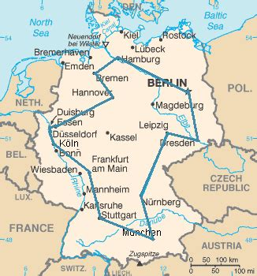

# Module: Neighborhood Exploration

------

## Requirements

The requirements for this class are:

- Data Structures and Algorithmic Complexity
   * Graph concepts
- Programming in Python or C/C++
- Module 1 - Fundamentals
- Module 2 - Greedy

------

## Topics

- ...


# Neighborhood Exploration

------

## Some Definitions (remember from Module 2)

Recall basic definitions for an optimization problem, such as solutions and evaluations, and classic NP-hard problems such as the Knapsack Problem and Traveling Salesman Problem.
More precisely:

- The $XS$ denotes a *Solution Space*, where $XE$ is an *Evaluation Space* (or *Objective Space*)
   * The pair $XES=\;<XS,XE>$ denotes the $XESolution$ space
   * A *SO optimization problem* is defined by the triple $<XS, XE, f>$
- The space $XE$ can be partioned into $XE=XFeasible \cup XInfeasible$, where $XFeasible \cap XInfeasible = \emptyset$
- $XS$ denotes all *valid representations of a solution*, that are *structurally correct*
   * it may include *infeasible* solutions $s$, that are *valid*, but with *infeasible* evaluation $f(s) \in XInfeasible$
   * it depends on how the problem is modeled, but it's not uncommon to have $XInfeasible \neq \emptyset$
- The optimal solution $s^*$ is always feasible $f(s^*) \in XFeasible$, unless the problem is *impossible*

## Neighborhood

Given a solution $s \in XS$, we define a *neighbor solution* $s' \in XS$ as:

- a *neighborhood* (or *neighborhood structure*) $\mathcal{N}(s)$ is *a set of solutions* reachable by some *move* function/operator $m : XS \mapsto XS$
- we say that $s' \in \mathcal{N}(s) \iff \exists m$ *such that* $s' = m(s)$ 
    * or, typically denoted by operator $\oplus$ notation: $s' = s \oplus m$


{height=60%}

## Reachability of Solutions and Move Composition

We recall an instance of the Knapsack Problem with 5 items and consider solutions $s_1 = (01001)$ and $s_2 = (11010)$ from $XS$

\newcommand{\Bigcirc}{\mathop{\bigcirc}}

- We consider the following move definition $M^{(I)} = \{m_1, m_2, ..., m_i\} =$ `{change the value of the bit i}`
- We can find moves $m_1,m_4,m_5 \in M^{(I)}$ such that $s_2 = ((s_1 \oplus m_1) \oplus m_4) \oplus m_5$
   * this changes the values of the first, fourth and fifth bits
   * the following intermediate solutions are visited in this path: $s_1 = (01001) \rightarrow (11001) \rightarrow (11011) \rightarrow (11010) = s_2$
- Alternatively, a composite move $m_{1,4,5}$ could be built with function composition: $m_{1,4,5} = m_5 \circ m_4 \circ m_1$; or $m_{1,4,5} = \bigcirc_{m \in (m_1, m_4, m_5)} m$ or by using $\mapsto$ sequential notation: $m_{1,4,5} = m_1 \mapsto m_4 \mapsto m_5$
   * In other words, $m_{1,4,5}(s) = m_5(m_4(m_1(s)))$
- Now we consider moves $M^{(II)}$ where two bits $i$ and $j$ are simultaneously changed (**Exercise:** What is the size of this neighborhood?)
   * Solution $s_2$ could never be reachable by $s_1$ in such neighborhood!


## Move Cost

Given a move $m$ and function $f$, we can compute the *move cost*  $\bar{m}^f$ (or simply $\bar{m}$) in the following way:

- given an evaluation function $f : XS \mapsto XE$, and $e=f(s)$ denoting the *evaluation* of a solution $s$ (when $f$ is known, it can be ommited)
- given a *neighbor* $s' = m(s)$ the *move cost* $\bar{m}(s)$ is defined by $\bar{m}(s)=\bar{m}^f(s)=f(s')-f(s)$ 
- naturally, any $e \in XE$ space must support *add* and *subtract* basic arithmetics
- we **do not** require $XE$ to be a *total order*, although this is true for *single objective optimization*, i.e., *minimization* or *maximization*
- we say that moves $M=(m_1, m_2, ...)$ are *independent* if *composite move* $m' = \bigcirc_{m \in M} m$ has a fixed cost $\bar{m'}(s)=\sum_{m \in M} \bar{m}(s)$, $\forall s \in XS$
   * this is an important property for newer neighborhood strategies in literature!


## Example for the Traveling Salesman Problem (euclidean)

Let's think of a neighborhood structure for the TSP.
What is a move? How much does it cost?

{width=50%}


# Neighborhood Exploration Primitives

## Neighborhood Exploration: Basic Primitives

Given a solution $s \in XS$, a neighborhood $\mathcal{N}$ and its associated *move set* $\mathcal{M}=\{m_1, m_2, m_3, ...\}$ such that $\mathcal{N}=\{m_1(s), m_2(s), m_3(s), ...\}$, we define two basic neighborhood exploration primitives: `RandomMove` and `AllMoves`.

- the `RandomMove` returns a *random move* $\{m\}$ from move set $\mathcal{M}$
- the `AllMoves` returns a sequence $\mathcal{M}^P=(m_1, m_2, ...)$ of move set $\mathcal{M}$ 

Typically, two complementary primitives are built on top of `AllMoves`: `FirstMove` and `NextMove`.

- $FirstMove(\mathcal{N},s)$ returns $\{m_1\}$, where $m_1$ is the first move from $\mathcal{M}^P$
- $NextMove(\mathcal{N},s, m_i)$ returns $\{m_{i+1}\}$, where $m_i$ is a move from $\mathcal{M}^P$

Note that returned moves may not exist, so one must check it! (typical *optional* behavior...)

## Neighborhood Exploration: Find Primitives

Given a neighborhood $\mathcal{N}$ and solution $s \in XS$, we define three neighborhood exploration primitives: `FindAny`,  `FindFirst` and `FindBest`.

- the `FindAny` tries to find *any* move $m'$ with $s'=m'(s) \in \mathcal{N}(s)$ that *improves* $s$
   * we assume a more restricted neighborhood $\mathcal{N}_{\leq \kappa} \subseteq \mathcal{N}$, where $|\mathcal{N}_{\leq \kappa}| \leq k$
   * assuming *minimization*, if such $s' \in \mathcal{N}_{\leq \kappa}(s)$ exists, then $f(s') < f(s)$
- the `FindFirst` tries to find *the first* move $m_i$ with $s_i=m_i(s) \in \mathcal{N}(s) = \{s_1, ..., s_i, ...\}$ that *improves* current solution $s$
   * assuming *minimization*, if such $s_i \in \mathcal{N}(s)$ exists, then $i$ is the *smallest value* such that $f(s_i) < f(s)$
- the `FindBest` tries to find *the best* move $m^*$ with $s^* = m^*(s) \in \mathcal{N}(s)$ that *improves* current solution $s$
   * assuming *minimization*, if such $s^* \in \mathcal{N}(s)$ exists, then $f(s^*) < f(s)$ and $f(s^*) \leq f(s'),\; \forall s' \in \mathcal{N}(s)$

## Pseudocode for Find Primitives: FindAny

The `FindAny` considers, without loss of generality, a minimization function $f$, a neighborhood $\mathcal{N}$, a value $\kappa_{max}$, a pseudorandom function $\xi(.)$, stop criteria $stop(.)$ and current solution $s$. 
It can be implemented in the following way:

\begin{algorithmic}
\Procedure{FindAny}{$f(.)$, $\mathcal{N}(.)$, $\kappa_{max}$, $\xi(.)$, $stop(.)$, $s$}
   \State $k \gets 0$
   \While{$k < \kappa_{max}$ \textbf{and} \textbf{not} $stop(time(), f(s))$}
         \State $m \gets RandomMove(\mathcal{N}, s, \xi)$
         \If{$\bar{m}^f(s) < 0$}
            \State \textbf{return} $\{m\}$
         \Else
            \State $k \gets k+1$
         \EndIf
   \EndWhile
   \State \textbf{return} $\{\}$
\EndProcedure
\end{algorithmic}

## Pseudocode for Find Primitives: FindFirst

The `FindFirst` considers, without loss of generality, a minimization function $f$, a neighborhood $\mathcal{N}$, stop criteria $stop(.)$ and current solution $s$. 
It can be implemented in the following way:

\begin{algorithmic}
\Procedure{FindFirst}{$f(.)$, $\mathcal{N}(.)$, $stop(.)$, $s$}
   \State $m \gets FirstMove(\mathcal{N}, s)$
   \While{$\exists m$ \textbf{and} \textbf{not} $stop(time(), f(s))$}
         \If{$\bar{m}^f(s) < 0$}
            \State \textbf{return} $\{m\}$
         \Else
            \State $m \gets NextMove(\mathcal{N}, s, m)$
         \EndIf
   \EndWhile
   \State \textbf{return} $\{\}$
\EndProcedure
\end{algorithmic}

## Pseudocode for Find Primitives: FindBest

The `FindBest` considers, without loss of generality, a minimization function $f$, a neighborhood $\mathcal{N}$, stop criteria $stop(.)$ and current solution $s$. 
It can be implemented in the following way:

\begin{algorithmic}
\Procedure{FindBest}{$f(.)$, $\mathcal{N}(.)$, $stop(.)$, $s$}
   \State $m \gets FirstMove(\mathcal{N}, s)$
   \State \textbf{if} $\not\exists m$ \textbf{then} \textbf{return} $\{\}$
   \State $\left<e^*, m^*\right> \gets \left<\bar{m}^f(s), m\right>$
   \While{$\exists m$ \textbf{and} \textbf{not} $stop(time(), f(s))$}
         \If{$\bar{m}^f(s) < e^*$}
            \State $\left<e^*, m^*\right> \gets \left<\bar{m}^f(s), m\right>$
         \EndIf
         \State $m \gets NextMove(\mathcal{N}, s, m)$
   \EndWhile
   \State \textbf{if} $e^* < 0$ \textbf{then} \textbf{return} $\{m^*\}$ \textbf{else} \textbf{return} $\{\}$
\EndProcedure
\end{algorithmic}

# Local Search and Refinement Heuristics


## Heuristics for Neighborhood Exploration and Local Optima

Given a neighborhood $\mathcal{N}$ and a solution $s$, we can explore it, in order to improve solution $s$ by finding a better *neighbor* $s'$

Some heuristics for neighborhood exploration are classic, mainly three: *random selection* (RS); *first improvement* (FI); and *best improvement* (BI). We have also proposed a *multi improvement* (MI) strategy that will be studied later.

These are also called *refinement heuristics* and are the foundations for several *local search* (LS) algorithms.

Differently from a *global search* (GS) algorithm, that tries to find an *optimal solution*, a *local search* tries to find a *locally optimal solution* regarding some specific neighborhood $\mathcal{N}$.

- So, recalling the basic definitions with $XE$ as a *total order*, we define *local optima* $s^* \in XS$, given neighborhood $\mathcal{N}$ and a solution $s \in XS$:
   * For *minimization*, we have that $f(s^*) \leq f(s'), \forall s' \in \mathcal{N}(s)$
   * For *maximization*, we have that $f(s^*) \geq f(s'), \forall s' \in \mathcal{N}(s)$


## Some Refinement Heuristics and Local Search

In the same way that *constructive heuristics* are able to generate initial solutions, the *Refinement Heuristics* can try to improve them.
In special, *local search* algorithms are refinment heuristics that try to reach some *local optima* related to one or many neighborhoods.

We have seen some neighborhood exploration primitives that try to generate an *improving move* over $\mathcal{N}$ for solution $s \in XS$. Now, the refinement heuristic $\mathcal{H}$ will try to return an *improving neighbor* $s' = \mathcal{H}(s) \in XS$ (naturally, if $\exists s'$ then $f(s') < f(s)$ for *minimization*).

We begin with classic refinement heuristics: *Random Selection*, *First Improvement* and *Best Improvement*.

## Refinement Heuristic: Random Selection

Given a neighborhood $\mathcal{N}$ and a parameter $\kappa_{max}$, the *Random Selection* (RS) heuristic is an implementation of the primitive `FindAny`:

- RS tries to find *any* solution $s' \in \mathcal{N}(s)$ that *improves* current solution $s \in XS$
- RS is limited to $k_{max}$ tries

\begin{algorithmic}
\Procedure{RandomSelection}{$f(.)$, $\mathcal{N}(.)$, $\kappa_{max}$, $\xi(.)$, $stop(.)$, $s$}
   \State $m \gets FindAny(f, \mathcal{N}, \kappa_{max}, \xi(.), stop, s)$
   \If{$\exists m$}
      \State \textbf{return} $\{m(s)\}$
   \Else
      \State \textbf{return} $\{\}$
   \EndIf
\EndProcedure
\end{algorithmic}

## Refinement Heuristic: First Improvement

Given a neighborhood $\mathcal{N}$, the *First Improvement* (FI) heuristic is an implementation of the primitive `FindFirst`:

- FI tries to find *the first* solution $s' \in \mathcal{N}(s)$ that *improves* current solution $s \in XS$

\begin{algorithmic}
\Procedure{FirstImprovement}{$f(.)$, $\mathcal{N}(.)$, $stop(.)$, $s$}
   \State $m \gets FindFirst(f, \mathcal{N}, stop, s)$
   \If{$\exists m$}
      \State \textbf{return} $\{m(s)\}$
   \Else
      \State \textbf{return} $\{\}$
   \EndIf
\EndProcedure
\end{algorithmic}

## Refinement Heuristic: Best Improvement

Given a neighborhood $\mathcal{N}$, the *Best Improvement* (BI) heuristic is an implementation of the primitive `FindBest`:

- FI tries to find *the best* solution $s' \in \mathcal{N}(s)$ that *improves* current solution $s \in XS$

\begin{algorithmic}
\Procedure{BestImprovement}{$f(.)$, $\mathcal{N}(.)$, $stop(.)$, $s$}
   \State $m \gets FindBest(f, \mathcal{N}, stop, s)$
   \If{$\exists m$}
      \State \textbf{return} $\{m(s)\}$
   \Else
      \State \textbf{return} $\{\}$
   \EndIf
\EndProcedure
\end{algorithmic}

## Classic Local Search techniques

We now explore some classic local search techniques, such as: *Hill Climbing* (HC), *Random Descent Method* (RDM) and *Variable Neighborhood Descent* (VND).


### Combining refinement heuristics
Each of these local search methods can be combined with all previous refinement heuristics.

### Reaching local optimality
Not all of these local search methods can guarantee local optimality, but *they will try!*.


## Local Search: Hill Climbing

Given a refinement heuristic $\mathcal{H}$ that explores some neighborhood and a solution $s \in XS$, the *Hill Climbing* (HC) is an iterative algorithm that finds a *local optimum*. HC is very simple and popular ([see wiki](https://en.wikipedia.org/wiki/Hill_climbing)).

- HC is also known as *Simple Hill Climbing*, when integrated with *FI*
- HC is also known as *Steepest Ascent/Descent Hill Climbing*, when integrated with *BI*
- HC is also known as *Stochastic Hill Climbing*, when integrated with *RS*

\begin{algorithmic}
\Procedure{HillClimbing}{$f(.)$, $\mathcal{H}(.)$, $stop(.)$, $s$}
   \State $s' \gets \mathcal{H}^{f, stop}(s)$
   \While{$\exists s'$ \textbf{and} \textbf{not} $stop(time(), f(s'))$}
      \State $s \gets s'$
      \State $s' \gets \mathcal{H}^{f, stop}(s)$
   \EndWhile
   \State \textbf{return} $\{s\}$
\EndProcedure
\end{algorithmic}

## Local Search: Random Descent Method

Given a neighborhood $\mathcal{N}$, a parameter $\kappa_{max}$ and a solution $s \in XS$, the *Random Descent Method* (RDM) is an iterative algorithm that tries to finds a *local optimum*. It is very similar to the *Stochastic Hill Climbing*.

\begin{algorithmic}
\Procedure{RandomDescentMethod}{$f(.)$, $\mathcal{N}(.)$, $\kappa_{max}$, $\xi$, $stop(.)$, $s$}
   \State $k gets 0$
   \While{$k < \kappa_{max}$ \textbf{and} \textbf{not} $stop(time(), f(s))$}
      \State $m \gets RandomMove(\mathcal{N}, s, \xi)$
      \If{$\exists m$ \textbf{and} $\bar{m}^f(s) < 0$}   
         \State $s \gets m(s)$
         \State $k \gets 0$
      \Else 
         \State $k \gets k+1$
      \EndIf
   \EndWhile
   \State \textbf{return} $\{s\}$
\EndProcedure
\end{algorithmic}

## Local Search: Variable Neighborhood Descent

Given *multiple* refinement heuristics $\mathcal{H}_1,\mathcal{H}_2, ..., \mathcal{H}_k$ that explore some neighborhoods and a solution $s \in XS$, the *Variable Neighborhood Descent* (VND) is an iterative algorithm that finds a *local optimum* regarding *all neighborhoods*. 

- VND is very sensitive the order of neighborhoods
   * typically, start from *smaller* then explore the *larger*

\begin{algorithmic}
\Procedure{VND}{$f(.)$, $\mathcal{H}_k(.)$, $stop(.)$, $s$}
   \State $i \gets 1$
   \While{$i \leq k$ \textbf{and} \textbf{not} $stop(time(), f(s))$}
      \State $s' \gets \mathcal{H}_i^{f, stop}(s)$
      \State \textbf{if} $\exists s'$ \textbf{then} $\left<s, i\right> \gets \left< s', 1\right>$ \textbf{else} $i \gets i+1$
   \EndWhile
   \State \textbf{return} $\{s\}$
\EndProcedure
\end{algorithmic}

## Local Search: Randomized Variable Neighborhood Descent

In 2010, our research group proposed a *randomized* version of VND, called *Randomized Variable Neighborhood Descent* (RVND). 

In fact, two subgroups independently proposed the same technique (see Souza 2010 and Anand 2010)

- RVND is not sensitive the order of neighborhoods

\begin{algorithmic}
\Procedure{RVND}{$f(.)$, $\mathcal{H}'_k(.)$, $\xi$, $stop(.)$, $s$}
   \State $\mathcal{H} \gets shuffle^\xi(\mathcal{H}')$
   \State $i \gets 1$
   \While{$i \leq k$ \textbf{and} \textbf{not} $stop(time(), f(s))$}
      \State $s' \gets \mathcal{H}_i^{f, stop}(s)$
      \State \textbf{if} $\exists s'$ \textbf{then} $\left<s, i\right> \gets \left< s', 1\right>$ \textbf{else} $i \gets i+1$
   \EndWhile
   \State \textbf{return} $\{s\}$
\EndProcedure
\end{algorithmic}


# Advanced Topic: Multi Improvement

## MultiImprovement: the Idea


Given a solution $s \in XS$, a neighborhood $\mathcal{N}$ and its associated *move set* $\mathcal{M}$, the *Multi Improvement* (MI) heuristic is an implementation of the primitive `FindFirst` or `FindBest` over a compound neighborhood $\mathcal{N}^{\circ}$.

The compound neighborhood $\mathcal{N}^{\circ}$ is associated to a compound move set $\mathcal{M}^{\circ} = \{m^\circ | m^\circ = \bigcirc_{ m \in \mathcal{X} }  m, \forall \mathcal{X} \in^\pi \mathcal{M}^{\star} \}$ that be seen as a set of *all move compositions* for $\mathcal{M}^{\star}$, which is *a subset of the powerset* $2^\mathcal{M}$ only containing *independent moves* for $s$.
Note that operator $\in^\pi$ takes a set of the powerset and also performs a permutation, transforming the selected set into a sequence.

Finding a "best" compound move can only be done exactly (and it's even NP-hard for some neighborhoods!).
So finding a "first" solution can be feasible on practice, by employing some "greedy" strategy.
In this sense, using CPU-GPU hybrid architecture can help deciding how such "FindFirst" operation can work efficiently, by organizing GPU blocks and shared memory in a smart way.

## Some formulation

Given $s \in XS$, a neighborhood $\mathcal{N}$ and its *move set* $\mathcal{M}$, we can formulate this problem as the following *maximization* problem:

$\max \bar{m}^\circ(s)$

$\mathcal{X} \in \mathcal{M}^{\star} \subseteq 2^\mathcal{M}$

$m^\circ = \bigcirc_{m \in \mathcal{X}} m$

Move Independence:

$\bar{m}^\circ(s) = \sum_{m \in \mathcal{P}} \bar{m}(s), \forall \mathcal{P} \in \Pi(\mathcal{X})$

Where, $\Pi(C)$ is the set of all permutations of set $C$.

## Exploring the Multi Improvement technique

Please read recent articles from our research group!

- A benchmark on multi improvement neighborhood search strategies in CPU/GPU systems (2016)
- Exploring parallel multi-GPU local search strategies in a metaheuristic framework (2018)
- A DVND local search implemented on a dataflow architecture for the minimum latency problem (2018)
- Multi Improvement: uma Solução Alternativa para o Problema de Roteamento de Veículos (2019)
- A multi-improvement local search using dataflow and GPU to solve the minimum latency problem (2020)
- Finding the maximum multi improvement on neighborhood exploration (2022)


# Practical Exercise

## Implementing a Local Search (Step 1/3)

- Choose a language: Python or C/C++
- Consider the following data for a Knapsack Problem with $n=5$ items and capacity $Q=10$

```
5
10
1 1 1 5 5
1 2 3 7 8
```

- Save it into a file and read it
   * First load the $n$ and $Q$
   * Then, for each item, load each profit $p_i$ and weight $w_i$

## Implementing a Local Search (Step 2/3)
- Model the solution representation as an array (or list) of booleans or binary numbers
- Create a neighborhood structure and two neighborhood exploration techniques (example: best improvement and first improvement)
- Generate multiple initial solutions with some randomness (example, 1000)
- Compute de Average cost and Computational time taken for each of the two refinement heuristics
- Which of these are the best one?

## Implementing a Local Search (Step 3/3)
- Now, choose some Local Search technique, such as Hill Climbing (for BI, FI or RS) or RDM
- Generate multiple initial solutions with some randomness (example, 1000)
- Apply each of the two Local Search on them, for each generated solution
- Compute de Average cost and Computational time taken for each of the two local searches
- Generate bigger instances, to make the problem harder!
- Which one is better?


# Discussions

## Short discussion

### Current scenario: optimization problems in the university and work

- Do you know of any optimization problem that needs to be solved in the university or your work?
- Can exact methods solve them? Do you need heuristic methods?
- Read the introduction material from prof Marcone (in Portuguese): http://www.decom.ufop.br/prof/marcone/Disciplinas/InteligenciaComputacional/InteligenciaComputacional.pdf

# Unused Slides


## Moves: Basic Primitives

Given a move $m$, a solution $s \in XS$ and its evaluation $e=f(s) \in XE$, we define three basic move primitives: `CanApply`,  `Apply` and `Cost`.

- the `CanApply` returns *true* only if $m(s) \in XS$, i.e., if the generated neighbor is a *valid solution* in $XS$ space
   * this can be useful when moves are clearly defined, such as changing a bit $i$ in a knapsack problem, but not all moves lead to valid solutions, for example, if knapsack capacity would be exceeded after move and that is not allowed in $XS$
- the `Apply` primitive returns pair $\left<m(s), m'\right>$, where $m'$ is an *undo move*, such that, $s=m'(m(s))$
   * only defined if `CanApply` is *true*
- the `Cost` primitive returns evaluation difference value $e_{diff} = f(m(s)) - f(s)$
   * only defined if `CanApply` is *true*

A fourth non-basic primitive typically used is the `ApplyUpdate`, that returns both the *solution neighbor* and its *evaluation* in a pair $\left<m(s), f(m(s))\right>$.

## Neighborhood Exploration: FindNext Primitive (extra)

Although not commonly used, one can define a `FindNext` primitive:

- the `FindNext` tries to find *the next* $s_i \in \mathcal{N}(s) = \{s_j, ..., s_i, ...\}$ that *improves* current solution $s$
   * assuming *minimization*, if such $s_i \in \mathcal{N}(s)$ exists, then $i$ is the *smallest value* such that $f(s_i) < f(s)$ and $i>j$

# Agradecimentos

-----

## Pessoas

Em especial, agradeço aos colegas que elaboraram bons materiais, como o prof. Raphael Machado, Kowada e Viterbo cujos conceitos formam o cerne desses slides.

Estendo os agradecimentos aos demais colegas que colaboraram com a elaboração do material do curso de [Pesquisa Operacional](https://github.com/igormcoelho/curso-pesquisa-operacional-i), que abriu caminho para verificação prática dessa tecnologia de slides.

-----

## Software

Esse material de curso só é possível graças aos inúmeros projetos de código-aberto que são necessários a ele, incluindo:

- pandoc
- LaTeX
- GNU/Linux
- git
- markdown-preview-enhanced (github)
- visual studio code
- atom
- revealjs
- groomit-mpx (screen drawing tool)
- xournal (screen drawing tool)
- ...

-----

## Empresas

Agradecimento especial a empresas que suportam projetos livres envolvidos nesse curso:

- github
- gitlab
- microsoft
- google
- ...

-----

## Reprodução do material

Esses slides foram escritos utilizando pandoc, segundo o tutorial ilectures:

- https://igormcoelho.github.io/ilectures-pandoc/

Exceto expressamente mencionado (com as devidas ressalvas ao material cedido por colegas), a licença será Creative Commons.

**Licença:** CC-BY 4.0 2020

Igor Machado Coelho

-------

## This Slide Is Intentionally Blank (for goomit-mpx)
