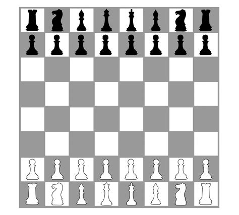

# Module: Neighborhood Exploration

------

## Requirements

The requirements for this class are:

- Data Structures and Algorithmic Complexity
   * Graph concepts
- Programming in Python or C/C++
- Module 1 - Fundamentals
- Module 2 - Greedy

------

## Topics

- ...


# Neighborhood Exploration

------

## Some Definitions (remember from Module 2)

Recall basic definitions for an optimization problem, such as solutions and evaluations, and classic NP-hard problems such as the Knapsack Problem and Traveling Salesman Problem.
More precisely:

- The $XS$ denotes a *Solution Space*, where $XE$ is an *Evaluation Space* (or *Objective Space*)
   * The pair $XES=\;<XS,XE>$ denotes the $XESolution$ space
   * A *SO optimization problem* is defined by the triple $<XS, XE, f>$
- The space $XE$ can be partioned into $XE=XFeasible \cup XInfeasible$, where $XFeasible \cap XInfeasible = \emptyset$
- $XS$ denotes all *valid representations of a solution*, that are *structurally correct*
   * it may include *infeasible* solutions $s$, that are *valid*, but with *infeasible* evaluation $f(s) \in XInfeasible$
   * it depends on how the problem is modeled, but it's not uncommon to have $XInfeasible \neq \emptyset$
- The optimal solution $s^*$ is always feasible $f(s^*) \in XFeasible$, unless the problem is *impossible*

## Neighborhood

Given a solution $s \in XS$, we define a *neighbor solution* $s' \in XS$ as:

- a *neighborhood* (or *neighborhood structure*) $\mathcal{N}(s)$ is *a set of solutions* reachable by some *move* function/operator $m : XS \mapsto XS$
- we say that $s' \in \mathcal{N}(s) \iff \exists m$ *such that* $s' = m(s)$ 
    * or, typically denoted by operator $\oplus$ notation: $s' = s \oplus m$


{height=60%}

## Reachability of Solutions and Move Composition

We recall an instance of the Knapsack Problem with 5 items and consider solutions $s_1 = (01001)$ and $s_2 = (11010)$ from $XS$

\newcommand{\Bigcirc}{\mathop{\bigcirc}}

- We consider the following move definition $M^{(I)} = \{m_1, m_2, ..., m_i\} =$ \texttt{\{~change the value of the bit $i$\}}
- We can find moves $m_1,m_4,m_5 \in M^{(I)}$ such that $s_2 = ((s_1 \oplus m_1) \oplus m_4) \oplus m_5$
   * this changes the values of the first, fourth and fifth bits
   * the following intermediate solutions are visited in this path: $s_1 = (01001) \rightarrow (11001) \rightarrow (11011) \rightarrow (11010) = s_2$
- Alternatively, a composite move $m_{1,4,5}$ could be built with function composition: $m_{1,4,5} = m_5 \circ m_4 \circ m_1$; or $m_{1,4,5} = \bigcirc_{m \in (m_1, m_4, m_5)} m$ or by using $\mapsto$ sequential notation: $m_{1,4,5} = m_1 \mapsto m_4 \mapsto m_5$
   * In other words, $m_{1,4,5}(s) = m_5(m_4(m_1(s)))$
- Now we consider moves $M^{(II)}$ where two bits $i$ and $j$ are simultaneously changed (**Exercise:** What is the size of this neighborhood?)
   * Solution $s_2$ could never be reachable by $s_1$ in such neighborhood!


## Move Cost

Given a move $m$, we can compute the *move cost*  $\bar{m}$ in the following way:

- given an evaluation function $f : XS \mapsto XE$, and $e=f(s)$ denoting the *evaluation* of a solution $s$
- given a *neighbor* $s' = m(s)$ the *move cost* $\bar{m}(s)$ is defined by $\bar{m}(s)=f(s')-f(s)$ 
- naturally, any $e \in XE$ space must support *add* and *subtract* basic arithmetics
- we **do not** require $XE$ to be a *total order*, although this is true for *single objective optimization*, i.e., *minimization* or *maximization*
- we say that moves $M=(m_1, m_2, ...)$ are *independent* if *composite move* $m' = \bigcirc_{m \in M} m$ has a fixed cost $\bar{m'}(s)=\sum_{m \in M} \bar{m}(s)$, $\forall s \in XS$
   * this is an important property for newer neighborhood strategies in literature!

## Example for the Traveling Salesman Problem (euclidean)

Let's think of a neighborhood structure for the TSP.
What is a move? How much does it cost?

{width=50%}


# Heuristics for Neighborhood Exploration

## Heuristics for Neighborhood Exploration and Local Optima

Given a neighborhood $\mathcal{N}$ and a solution $s$, we can explore it, in order to improve solution $s$ by finding a better *neighbor* $s'$

Some heuristics for neighborhood exploration are classic, mainly three: *random selection* (RS); *first improvement* (FI); and *best improvement* (BI). We have also proposed a *multi improvement* (MI) strategy that will be studied later.

These are also called *refinement heuristics* and are the foundations for several *local search* (LS) algorithms.

Differently from a *global search* (GS) algorithm, that tries to find an *optimal solution*, a *local search* tries to find a *locally optimal solution* regarding some specific neighborhood $\mathcal{N}$.

- So, recalling the basic definitions with $XE$ as a *total order*, we define *local optima* $s^* \in XS$, given neighborhood $\mathcal{N}$ and a solution $s \in XS$:
   * For *minimization*, we have that $f(s^*) \leq f(s'), \forall s' \in \mathcal{N}(s)$
   * For *maximization*, we have that $f(s^*) \geq f(s'), \forall s' \in \mathcal{N}(s)$

## Neighborhood Exploration: Four Primitives

Given a neighborhood $\mathcal{N}$ and solution $s \in XS$, we define four neighborhood exploration primitives: \texttt{FindAny},  \texttt{FindFirst},  \texttt{FindNext} and  \texttt{FindBest}.

- the \texttt{FindAny} tries to find *any* solution $s' \in \mathcal{N}(s)$ that *improves* $s$
   * we assume a more restricted neighborhood $\mathcal{N}_{\leq k} \subseteq \mathcal{N}$, where $|\mathcal{N}_{\leq k}| \leq k$
   * assuming *minimization*, if such $s' \in \mathcal{N}_{\leq k}(s)$ exists, then $f(s') < f(s)$
- the \texttt{FindFirst} tries to find *the first* $s_i \in \mathcal{N}(s) = \{s_1, ..., s_i, ...\}$ that *improves* current solution $s$
   * assuming *minimization*, if such $s_i \in \mathcal{N}(s)$ exists, then $i$ is the *smallest value* such that $f(s_i) < f(s)$
- the \texttt{FindNext} tries to find *the next* $s_i \in \mathcal{N}(s) = \{s_j, ..., s_i, ...\}$ that *improves* current solution $s$
   * assuming *minimization*, if such $s_i \in \mathcal{N}(s)$ exists, then $i$ is the *smallest value* such that $f(s_i) < f(s)$ and $i>j$
- the \texttt{FindBest} tries to find *the best* $s^* \in \mathcal{N}(s)$ that *improves* current solution $s$
   * assuming *minimization*, if such $s^* \in \mathcal{N}(s)$ exists, then $f(s^*) < f(s)$ and $f(s^*) \leq f(s'),\; \forall s' \in \mathcal{N}(s)$


## Neighborhood Exploration: Random Selection

Given a neighborhood $\mathcal{N}$ and a parameter $k_{max}$, the *Random Selection* (RS) heuristic is an implementation of the primitive \texttt{FindAny}:

- RS tries to find *any* solution $s' \in XS$ that *improves* current solution $s \in XS$
- RS is limited to $k_{max}$ tries

## Neighborhood Exploration: First Improvement

TODO

## Neighborhood Exploration: Best Improvement

TODO

# Local Search techniques

## Creating a Local Search: Hill Climbing

TODO

## Creating a Local Search: Random Descent Method

TODO

# Advanced Topic: Multi Improvement

## Exploring the Multi Improvement technique

TODO

# Practical Exercise

## Implementing a Local Search (Step 1/3)

- Choose a language: Python or C/C++
- Consider the following data for a Knapsack Problem with $n=5$ items and capacity $Q=10$

```
5
10
1 1 1 5 5
1 2 3 7 8
```

- Save it into a file and read it
   * First load the $n$ and $Q$
   * Then, for each item, load each profit $p_i$ and weight $w_i$

## Implementing a Local Search (Step 2/3)
- Model the solution representation as an array (or list) of booleans or binary numbers
- Create a neighborhood structure and two neighborhood exploration techniques (example: best improvement and first improvement)

## Implementing a Local Search (Step 3/3)
- Choose some Local Search technique, such as Hill Climbing (for BI and FI), or RDM (for RS)
- Generate multiple initial solutions with some randomness (example, 1000)
- Apply each of the two Local Search on them, for each generated solution
- Compute de Average cost and Computational time taken for each of the two local searches
- Generate bigger instances, to make the problem harder!
- Which one is better?


# Discussions

## Short discussion

### Current scenario: optimization problems in the university and work

- Do you know of any optimization problem that needs to be solved in the university or your work?
- Can exact methods solve them? Do you need heuristic methods?
- Read the introduction material from prof Marcone (in Portuguese): http://www.decom.ufop.br/prof/marcone/Disciplinas/InteligenciaComputacional/InteligenciaComputacional.pdf

# Agradecimentos

-----

## Pessoas

Em especial, agradeço aos colegas que elaboraram bons materiais, como o prof. Raphael Machado, Kowada e Viterbo cujos conceitos formam o cerne desses slides.

Estendo os agradecimentos aos demais colegas que colaboraram com a elaboração do material do curso de [Pesquisa Operacional](https://github.com/igormcoelho/curso-pesquisa-operacional-i), que abriu caminho para verificação prática dessa tecnologia de slides.

-----

## Software

Esse material de curso só é possível graças aos inúmeros projetos de código-aberto que são necessários a ele, incluindo:

- pandoc
- LaTeX
- GNU/Linux
- git
- markdown-preview-enhanced (github)
- visual studio code
- atom
- revealjs
- groomit-mpx (screen drawing tool)
- xournal (screen drawing tool)
- ...

-----

## Empresas

Agradecimento especial a empresas que suportam projetos livres envolvidos nesse curso:

- github
- gitlab
- microsoft
- google
- ...

-----

## Reprodução do material

Esses slides foram escritos utilizando pandoc, segundo o tutorial ilectures:

- https://igormcoelho.github.io/ilectures-pandoc/

Exceto expressamente mencionado (com as devidas ressalvas ao material cedido por colegas), a licença será Creative Commons.

**Licença:** CC-BY 4.0 2020

Igor Machado Coelho

-------

## This Slide Is Intentionally Blank (for goomit-mpx)
